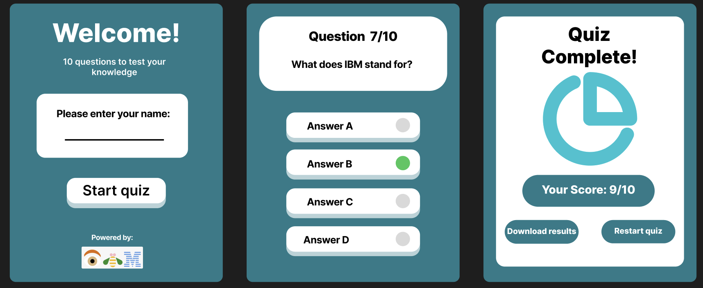
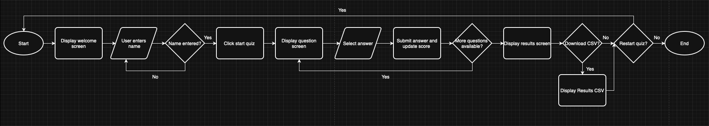
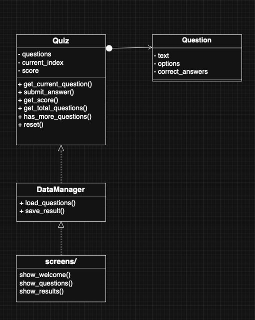
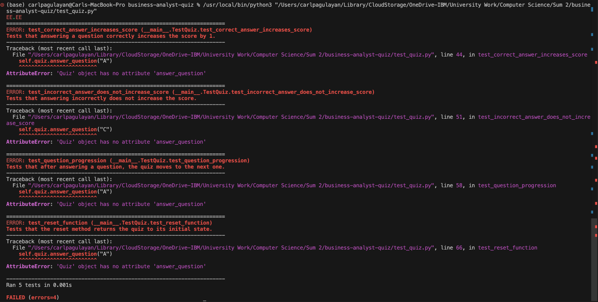

# business-analyst-quiz

## Introduction 
Working within a public-sector consulting environment has taught me about how influential my work handling data and service delivery directly affects the clients' work, as well as other key stakeholders. As a business analyst (BA), my role involves engaging with stakeholders through user sessions where I understand the as-is of the business process, and these are then documented and translated into clear requirements. Much of this works on strong foundational skills and knowledge, such as how to handle confidential information and how to apply core BA techniques to support decision making.

The workplace environment I operate in is highly collaborative, receiving input from both colleagues and clients, and is very dynamic. Projects often involve multiple teams, each with different levels of technical understanding and exposure to data. Because of this, there is a continuous need for accessible learning tools to reinforce good practice, especially in areas such as ethical data handling, process awareness and basic analytical thinking. These topics reinforce the conversations I have with colleagues and stakeholders, whether during a user story walkthrough or process mapping sessions - all tailored towards a starting business analyst. 

From my own experience starting in this role, I realised how much quicker my confidence would have grown if I’d had simple tools like this to reinforce the basics. If I were starting again, a quiz like this would have helped kick‑start my understanding of a my new business analyst role. My proposed MVP is a simple interactive quiz application, which addresses this and provides a lightweight, engaging way for staff to test and reinforce their understanding of these core concepts. The quiz focuses on ethics and data awareness, alongside basic BA tools and process-mapping principles. These areas were chosen because they represent everyday responsibilities within public-sector projects, yet they are often misunderstood or inconsistently applied. By presenting a mix of knowledge and scenario-based questions, the quiz encourages users to think about their own role - a significant aspect for employees within foundation.

## GUI Design (Figma Prototype)
The planned user interface follows a simple, linear user journey designed to make the quiz easy to understand and navigate. The flow consists of three core screens:

1. Home Screen - introduces the quiz, prompts the user to enter their name and provides a clear “Start Quiz” button.
2. Question Screen - displays one multiple‑choice question at a time, with clearly separated answer options and a progress indicator.
3. Results Screen – shows the user’s score, displays a pie chart and provides an option to export or restart. 

The design uses a clean layout with large buttons, high‑contrast colours, and minimal text to support accessibility. The screenshots are provided here below:



### User journey flowchart



## Functional Requirements

| ID | Requirement Specification | Area Covered |
|----|---------------------------|--------------|
| FR‑1 | Start the quiz from the home screen | User Flow |
| FR‑2 | Load questions from a CSV file | Data Handling |
| FR‑3 | Display one question at a time with multiple‑choice answers | User Interface |
| FR‑4 | Validate user selections and track correct answers | Logic / Scoring |
| FR‑5 | Show final score at the end of the quiz | Output / Feedback |
| FR‑6 | Allow exporting results to a CSV file | Data Export |
| FR‑7 | Store quiz data persistently so results can be reviewed later | Data Persistence |
| FR‑8 | Handle invalid inputs gracefully (e.g., empty CSV, missing fields) | Error Handling |

## Non‑Functional Requirements

| ID | Requirement Specification | Area Covered |
|----|---------------------------|--------------|
| NFR‑1 | Clear layouts, consistent spacing, visually distinct buttons | Engagement / UI |
| NFR‑2 | Simple, intuitive interface suitable for non‑technical staff | Usability |
| NFR‑3 | Readable fonts,keyboard‑friendly navigation | Accessibility |
| NFR‑4 | Questions load instantly with no noticeable delays | Performance |
| NFR‑5 | Quiz should run without crashing or losing progress | Reliability |
| NFR‑6 | Code structured using classes and pure functions | Maintainability |
| NFR‑7 | Runs on any machine with Python installed | Portability |

## Tech Stack Outline
* Language: Python
* GUI Framework: Streamlit (lightweight and built‑in)
* Data Storage: CSV files for questions and results
* Version Control: Git + GitHub repository
* Documentation: Markdown README, docstrings, inline comments
* Testing: Python unittest for pure functions (e.g., answer validation)

### Code Design 



## Development Section 

### Quiz Class  
```python
class Quiz:

    def __init__(self, questions):
        self.questions = questions
        self.current_index = 0
        self.score = 0

    def get_current_question(self):
        return self.questions[self.current_index]

    def submit_answer(self, user_answer):
        current_question = self.get_current_question()

        if current_question.is_correct(user_answer):
            self.score += 1

        self.current_index += 1

    def has_more_questions(self):
        return self.current_index < len(self.questions)

    def get_score(self):
        return self.score

    def get_total_questions(self):
        return len(self.questions)

    def reset(self):
        self.current_index = 0
        self.score = 0
```
The Quiz class is the core engine of the application. It manages the quiz state, including the list of questions, the user’s score, and the current question index.
* submit_answer() checks whether the selected answer is correct and updates the score.
* has_more_questions() determines whether the quiz should continue.
* reset() restores the quiz to its initial state.
This class controls the entire quiz flow and ensures consistent behaviour throughout the application.

### Question Class
```python
class Question:
    def __init__(self, text, options, correct_answer):
        self.text = text
        self.options = options
        self.correct_answer = correct_answer
    
    def is_correct(self, user_answer):
        return user_answer == self.correct_answer
``` 
The Question class represents a single quiz question. It stores the question text, the list of answer options, and the correct answer.
The is_correct() method checks whether the user’s selected answer matches the correct one.
This class keeps question data structured and makes answer validation simple and reusable.

### Loading Questions 
```python
def load_questions():
    questions = []

    with open("questions.csv", "r") as f:
        reader = csv.reader(f)
        next(reader)  # Skip header row

        for row in reader:
            text = row[0]
            options = row[1:5]   # A, B, C, D
            correct = row[5]     # Correct answer letter

            q = Question(text, options, correct)
            questions.append(q)

    return questions
```
The load_questions() function reads quiz questions from a CSV file and converts each row into a Question object. This separates data storage from application logic, making the quiz easy to update by editing the CSV file rather than modifying code.

### Screen Routing 
```python
if not st.session_state.started:
    show_welcome()

elif st.session_state.quiz.has_more_questions():
    show_question()

else:
    show_results()
```

This routing logic determines which screen the user sees based on the quiz state.
* If the quiz has not started, the welcome screen is shown.
* If there are still questions remaining, the question screen is displayed.
* If all questions have been answered, the results screen is shown.

### Question Screen 
```python
def show_question():

    quiz = st.session_state.quiz
    question = quiz.get_current_question()

    st.header(f"Question {quiz.current_index + 1} of {quiz.get_total_questions()}")
    st.write(question.text)

    for option in question.options:
        if st.button(option):
            quiz.submit_answer(option)
            st.rerun()
```
The question screen displays the current question and its answer options.
Each option is shown as a button. When the user clicks one, the answer is submitted to the Quiz class, and the app reruns to load the next question.
This function connects the user interface to the underlying quiz logic and ensures smooth progression through the quiz.


## Testing Section 

### Testing Strategy and Methodology

Manual Testing (Black‑Box Testing)

Manual testing focused on how the quiz behaves from an end‑user perspective. I chose this method because it allows realistic interaction with the interface and helps identify usability issues that automated tests cannot detect.

Manual testing covered:
* Navigation between screens
* Entering a name and starting the quiz
* Selecting answers and progressing through questions
* Score calculation and personalised messages
* CSV download functionality
* Visual elements such as the colour theme and pie chart
* Handling of missing or invalid data

This ensured the quiz was aligned with the intended user experience.

Automated Unit Testing
Automated tests were written using Python’s built‑in unittest framework. This method was chosen because it provides a reliable way to test the core quiz logic independently of the Streamlit interface.

Unit tests focused on:
* Correct and incorrect answer handling
* Score updates
* Question progression
* Reset behaviour
* Initial quiz state

Automated testing ensures that the logic remains correct even if the UI changes in the future.

### Outcomes of Application Testing

Manual Testing Outcomes

| ID    | Test Description                     | Outcome Summary                                      |
|-------|---------------------------------------|-------------------------------------------------------|
| MT‑01 | Enter name on welcome screen          | Name successfully stored in session state             |
| MT‑02 | Start quiz button                     | Quiz begins at Question 1 as expected                 |
| MT‑03 | Select an answer                      | User progresses to the next question correctly        |
| MT‑04 | Score calculation                     | Score adds up only on correct answers              |
| MT‑05 | Results screen loads                  | Score, pie chart, and message all display correctly   |
| MT‑06 | Personalised message                  | Message shown matches the correct score range         |
| MT‑07 | Download CSV                          | CSV downloads successfully with all stored results    |
| MT‑08 | Restart quiz                          | Quiz resets to Question 1 with no issues              |
| MT‑09 | Colour theme                          | Background colour #227B89 applied consistently        |
| MT‑10 | Missing/empty CSV handling            | Application handles missing/empty CSV                 |

Unit Testing Outcomes
Automated unit tests were written in test_quiz.py and executed using:
python3 -m unittest test_quiz.py

The tests validated:
* The quiz starts with the correct initial state
* Correct answers increase the score
* Incorrect answers do not increase the score
* The quiz progresses to the next question after answering
* The reset function returns the quiz to its initial state
All tests passed successfully.



## Documentation Section 

### User Documentation
This quiz application is designed for staff within my organisation to quickly test their knowledge of business‑analysis concepts in a simple and intuitive way. The interface runs entirely in a web browser using Streamlit, meaning no installation or technical skills are required.

### How to Use the Quiz

1. Open the application
Launching the app opens a welcome screen in your browser.

2. Enter your name
Your name is used to save your score into the results file.

3. Start the quiz
Select Start Quiz to begin.

4. Answer each question
One question appears at a time
Select one of the multiple‑choice options
The next question loads automatically

5. View your results
At the end of the quiz, you will see:
Your total score
A pie chart showing correct (green) vs incorrect (red) answers
A personalised message based on your score:
* 0–4: Practice makes perfect, (name)!
* 5–7: Good work, (name)!
* 8–10: Excellent job, (name)!

6. Download all results
A Download CSV button allows staff to export the full results file containing every user’s name, score, and total questions.
This is useful for training records or performance reviews.

7. Restart the quiz
Select Restart Quiz to try again.
This workflow ensures the quiz is accessible to non‑technical staff, with clear navigation and minimal steps.

## Project Structure
```text
business-analyst-quiz/
│
├── main.py                      # Streamlit UI controller
├── quiz.py                      # Quiz logic
├── question.py                  # Question model
├── data_manager.py              # CSV loading and saving
│
├── screens/                     # UI screens folder
│   ├── welcome_screen.py        # Welcome screen UI
│   ├── question_screen.py       # Question display UI
│   └── results_screen.py        # Results screen UI
│
├── questions.csv                # Quiz questions
├── results.csv                  # Saved results (name, score, total)
└── test_quiz.py                 # Unit tests
```

## How to Run the Application
1. Install dependencies
pip install streamlit pandas matplotlib

2. Run the application
streamlit run main.py
This launches the quiz in your browser.

Running Unit Tests
Unit tests are located in test_quiz.py and use Python’s built‑in unittest framework.
Run all tests with:
python3 -m unittest test_quiz.py

These tests validate:
Quiz scoring logic
Question progression
Reset behaviour
Correct vs incorrect answer handling

### Code Explanation

#### question.py:
Defines the Question class, which stores:
question text
four answer options
the correct answer
a method to check if a selected answer is correct

#### quiz.py:
Controls quiz flow:
tracks the current question
updates the score
moves to the next question
resets the quiz

#### data_manager.py:
Handles:
loading questions from questions.csv
saving results to results.csv in the format: name,score,total
appending a new row each time a user completes the quiz

#### main.py:
Implements the Streamlit interface:
welcome screen
question display
answer buttons
results screen
personalised score messages
green/red pie chart
CSV download button
consistent background colour (#227B89) across all screens

## Evaluation Section 

### What Went Well…
One of the most enjoyable parts of the project was designing the interface in Figma. Being able to prototype the quiz visually helped me understand how the final product should feel, and it made the development process more engaging. Personalising the quiz questions based on my own experience also added value to the MVP, as it ensured the content was relevant and meaningful, especially to early professionals.

My confidence with GitHub improved significantly compared to Summative 1. I used version control consistently throughout development, pushing changes regularly and treating the repository as a record of progress. This made it easier to track issues and understand how the project developed over time.

Task management was another area that went well. Instead of trying to complete everything at once, I broke the work into smaller steps. These small wins built momentum and helped me avoid feeling overwhelmed. Writing to CSV files also turned out to be more straightforward than expected, and I was able to implement the results‑saving feature cleanly. Originally, I placed all screens and logic inside main.py, but I later refactored the project into separate screen files. This helped me demonstrate better coding practice by improving readability and reducing errors.

Another aspect that went particularly well was creating the process map for the planned user journey. This is something I actively do in my Business Analyst role, so applying that skill in a development context felt natural and genuinely useful. It helped me think through the user flow more clearly and ensured the final product aligned with how a real user would interact with the system.


### Even Better If…
Although I completed the required unit tests, I found the testing process confusing at times - particularly understanding how to structure tests and when to use unittest versus pytest. With more time, I would deepen my understanding of testing frameworks and how to apply them effectively.

I also had ambitions to make the interface more visually dynamic, but some ideas were beyond the scope of my current skills. My expectations for the UI were slightly ahead of my technical ability, and I had to scale back to ensure the project remained maintainable and understandable.

There were additional features I would have liked to explore, such as a progress bar, animations between questions, or more advanced UI elements. These would have enhanced the user experience, but I chose not to include them to avoid over‑complicating the codebase.

Finally, my MVP would realistically be much larger. I was able to implement questions from various areas of Business Analytics, but in such a large tech/consulting company the quiz would only capture a glimpse into the knowledge and skills to be built upon. With more time and preparation, the MVP would be broken down into more than one quiz, highlighting areas such as process mapping, client conversations and data handling.


